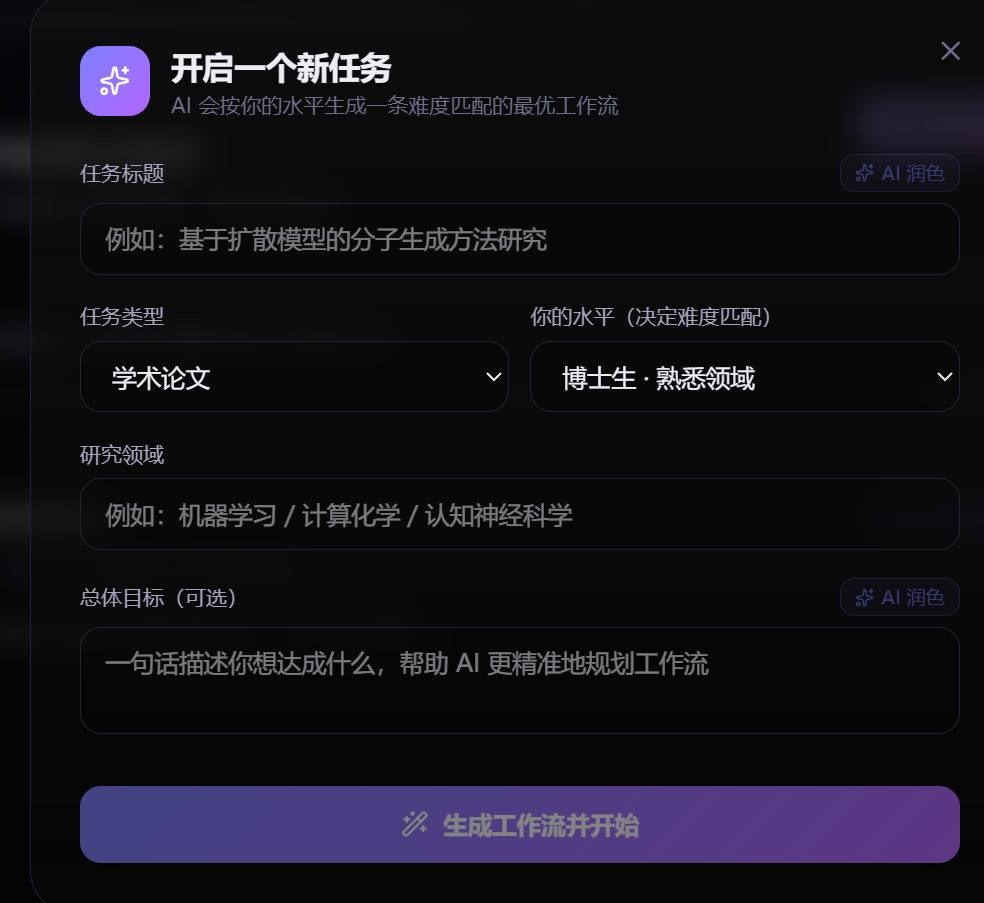
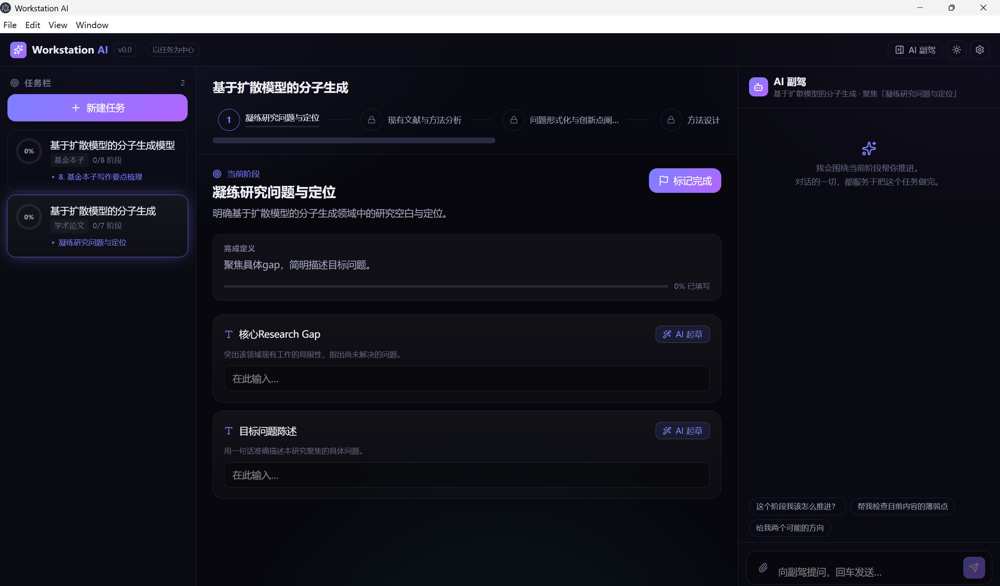
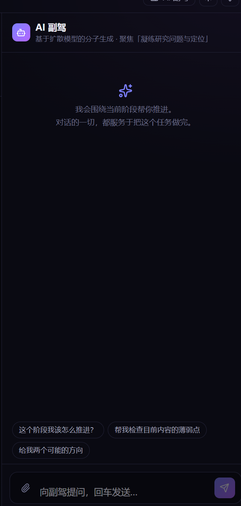

# 🛰️ Workstation AI

### 以任务为中心的 AI 工作站

**不是又一个聊天框，而是帮你把事情真正做完的工作台。**

`v0.0`  ·  `Windows x64`  ·  `Beta`  ·  `自带密钥 BYOK`

---

## 🤔 为什么做 Workstation AI

市面上的 AI 工具几乎都以**对话**为中心。可是真正的工作不是聊天聊出来的——它是**沿着一条清晰的流程，一步步把成果物做出来的**。

聊天工具的通病：聊得很爽，过两天回来看，关键信息全埋在无尽的对话历史里，任务进行到哪、下一步该干嘛，全靠脑子记。

**Workstation AI 把这件事反过来：以任务为中心，以成果物为中心，让 AI 的一切都服务于"把当前任务推进下去"。**

与此同时，它更强调“人在回路”：工作流把任务拆成几个你必须亲自想清楚的关键槽位，把注意力锁回任务本身，而不是被 AI 不断牵着发散。AI 只负责帮你把每个槽位填得更好，主导权始终在你手里。

| | 对话为中心的工具 | **Workstation AI** |
|---|---|---|
| 组织方式 | 线性对话历史 | **任务 → 工作流 → 阶段 → 结构化成果** |
| 进度感 | 无，靠自己记 | **可视化工作流，每阶段有目标与完成定义** |
| 上下文 | 每次重新解释 | **自动携带任务上下文与前序成果** |
| 产出 | 散落在聊天里 | **沉淀为可复用、可导出的结构化内容** |

 
左侧任务栏 · 中间工作流管线与结构化工作区 · 右侧 AI 副驾

---

## ✨ 核心功能

### 🎯 任务栏（像游戏任务栏一样管理你的项目）
左侧列出你所有的研究/工作任务，每个任务带**环形进度**、当前所处阶段、阶段计数。点开任意任务，主界面就是该任务的专属工作区——项目之间上下文完全隔离，互不干扰。

### 🧭 AI 生成的最优工作流（难度自适应）
新建任务时，AI 会按你的**身份与水平**（本科生 → PI）生成一条难度匹配的工作流：新手手把手、专家精简到位。每个阶段都有明确的**目标**和**完成定义**，并拆成需要你填的结构化字段。

以"学术论文"为例，工作流大致是：
**凝练问题 / Research Gap → 寻找文献证据 → 分析方法局限 → 形式化问题 → 设计方法 → 实验计划 → 撰写论文**

### 📝 结构化工作区（围绕"要填的内容"，而不是聊天）
主界面不是对话框，而是一张张**结构化字段卡片**。每张卡都支持：

- **AI 起草 / 润色**：一键生成或增强内容，**流式输出**边写边显示；
- **Tab 灰字补全**：写作时停顿片刻出现灰色续写建议，按 `Tab` 接受（克制、不打扰）；
- **Markdown 渲染**：表格、列表、公式自动排版，编辑/预览一键切换。

### 🤖 AI 副驾（一切对话都服务于当前任务）
右侧副驾**始终聚焦于你当前所在的任务与阶段**，自动携带你已填写的内容作为上下文。支持**拖拽上传 PDF 文献**，让 AI 基于文献内容回答。

### 🌗 深色 / 浅色主题
右上角一键切换深浅配色，偏好自动记住——长时间工作护眼，演示汇报体面。

### 🔐 自带密钥 · 本地优先
- **自带 API Key（BYOK）**：软件本身不内置任何密钥，也不提供模型服务；需你在设置中填入自己的 API 接口地址与密钥。
- **兼容 OpenAI 格式接口**：凡兼容 OpenAI Chat Completions 格式的接口（官方 OpenAI、各类中转、自建网关等）理论上均可使用，具体可用性以你所用的服务为准。
- **本地优先**：你的任务数据、草稿与密钥仅保存在本机；应用自身不设服务器、不做数据采集或回传。
- **关于 AI 调用**：当你主动使用 AI 功能时，**当前任务的相关内容**（你填写的字段、与副驾的对话、以及你上传的 PDF 文本）会按你的请求发送至**你自行配置的第三方模型接口**。这些数据如何被存储或使用取决于该接口提供方的条款，与本应用无关，请自行评估与遵守。

---

## 🚀 快速开始

### 1. 下载
| 版本 | 文件 | 说明 |
|---|---|---|
| **免安装版** | `WorkstationAI-0.0.0-portable.exe` | 双击即用，不写注册表，可放 U 盘 |
| **安装版** | `WorkstationAI-0.0.0-x64.exe` | 安装到本机，创建桌面快捷方式 |

### 2. 首次配置 API
首次启动会自动弹出**设置面板**，填入三项即可开始：

- **API 地址 (Base URL)**：如 `https://api.openai.com/v1` 或你的中转地址
- **API 密钥 (API Key)**：你的 `sk-...`
- **默认模型**：如 `gpt-4.1`

点击"测试连接"确认可用，保存即可。

> ⚠️ **关于 Windows 安全提示**：本软件目前未做代码签名，首次运行 Windows 可能提示"未知发布者"。点击 **"更多信息 → 仍要运行"** 即可，这不影响安全与使用。

---

## 🔒 隐私说明

- **本地存储**：所有任务、草稿与配置均保存在你本机 `%AppData%\Workstation AI\`。
- **密钥安全**：API 密钥仅保存在本地；本应用不会主动将其上传至任何服务器，调用时仅按标准方式用于向你配置的接口发起请求的鉴权。
- **无自有后端**：本应用没有自己的服务器，不进行数据采集、统计或回传。唯一的出网请求，是你主动触发、发往你自行配置的第三方模型接口的调用。
- **第三方接口**：发送到第三方模型接口的数据如何被处理，取决于该提供方的条款，请自行知悉并遵守。
- **重置**：如需彻底清除本地数据，删除 `%AppData%\Workstation AI\` 目录即可。

---

## 🗺️ Roadmap

- [ ] 成果物"一键汇聚"：写作阶段自动整合前序所有阶段产出为初稿
- [ ] 导出 Markdown / Word / LaTeX
- [ ] 更多工作流模板（综述、基金本子、商业计划、课程设计……）
- [ ] 命令面板（⌘K）与全局检索
- [ ] 自定义工作流编辑器

---

## 💬 使用交流群

遇到问题、想提建议、或想看后续更新，欢迎加群交流：

---

**Workstation AI** · 让 AI 围绕任务工作，而不是围绕对话。

本软件目前为闭源 Beta 版本，仅供学习与个人/科研使用。使用即视为同意 <a href="./EULA.md">最终用户许可协议（EULA）</a>。

